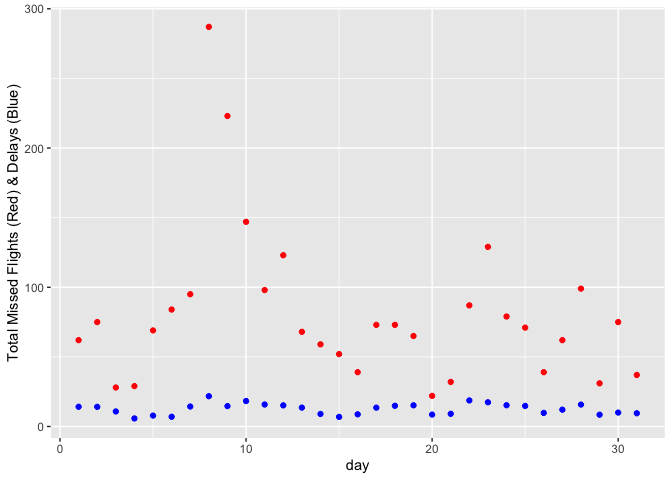

HW 1
================
Lily Franks
2022-09-20

***Setup***

``` r
library(dplyr)
```

    ## Warning: replacing previous import 'lifecycle::last_warnings' by
    ## 'rlang::last_warnings' when loading 'pillar'

    ## Warning: replacing previous import 'lifecycle::last_warnings' by
    ## 'rlang::last_warnings' when loading 'tibble'

    ## 
    ## Attaching package: 'dplyr'

    ## The following objects are masked from 'package:stats':
    ## 
    ##     filter, lag

    ## The following objects are masked from 'package:base':
    ## 
    ##     intersect, setdiff, setequal, union

``` r
library(nycflights13)
library(ggplot2)
```

``` r
flights
```

    ## # A tibble: 336,776 x 19
    ##     year month   day dep_time sched_dep_time dep_delay arr_time sched_arr_time
    ##    <int> <int> <int>    <int>          <int>     <dbl>    <int>          <int>
    ##  1  2013     1     1      517            515         2      830            819
    ##  2  2013     1     1      533            529         4      850            830
    ##  3  2013     1     1      542            540         2      923            850
    ##  4  2013     1     1      544            545        -1     1004           1022
    ##  5  2013     1     1      554            600        -6      812            837
    ##  6  2013     1     1      554            558        -4      740            728
    ##  7  2013     1     1      555            600        -5      913            854
    ##  8  2013     1     1      557            600        -3      709            723
    ##  9  2013     1     1      557            600        -3      838            846
    ## 10  2013     1     1      558            600        -2      753            745
    ## # … with 336,766 more rows, and 11 more variables: arr_delay <dbl>,
    ## #   carrier <chr>, flight <int>, tailnum <chr>, origin <chr>, dest <chr>,
    ## #   air_time <dbl>, distance <dbl>, hour <dbl>, minute <dbl>, time_hour <dttm>

``` r
flights2 = flights
```

***Question 1:*** **How many flights have a missing dep_time?**

``` r
sum(is.na(flights$dep_time))
```

    ## [1] 8255

**What other variables are missing?**

``` r
names(which(colSums(is.na(flights))>0))
```

    ## [1] "dep_time"  "dep_delay" "arr_time"  "arr_delay" "tailnum"   "air_time"

**What might these rows represent?** Cancelled flights.

***Question 2:*** **Currently dep_time and sched_dep_time are convenient
to look at, but hard to compute with because they’re not really
continuous numbers. Convert them to a more convenient representation of
number of minutes since midnight.**

``` r
convert_mins = function(val) {
  if (!is.na(val)) {
    hour = as.numeric(substr(val,1,nchar(val)-2)) #the hour
    min = val - round(val, -2) #the min 
    return ((hour*60) + min)
    
  } 
  
  else {
    next
    
  }
  
}
flights$dep_time = convert_mins(flights2$dep_time) 
```

    ## Warning in if (!is.na(val)) {: the condition has length > 1 and only the first
    ## element will be used

``` r
flights$sched_dep_time = convert_mins(flights2$sched_dep_time) 
```

    ## Warning in if (!is.na(val)) {: the condition has length > 1 and only the first
    ## element will be used

``` r
flights 
```

    ## # A tibble: 336,776 x 19
    ##     year month   day dep_time sched_dep_time dep_delay arr_time sched_arr_time
    ##    <int> <int> <int>    <dbl>          <dbl>     <dbl>    <int>          <int>
    ##  1  2013     1     1      317            315         2      830            819
    ##  2  2013     1     1      333            329         4      850            830
    ##  3  2013     1     1      342            340         2      923            850
    ##  4  2013     1     1      344            345        -1     1004           1022
    ##  5  2013     1     1      254            360        -6      812            837
    ##  6  2013     1     1      254            258        -4      740            728
    ##  7  2013     1     1      255            360        -5      913            854
    ##  8  2013     1     1      257            360        -3      709            723
    ##  9  2013     1     1      257            360        -3      838            846
    ## 10  2013     1     1      258            360        -2      753            745
    ## # … with 336,766 more rows, and 11 more variables: arr_delay <dbl>,
    ## #   carrier <chr>, flight <int>, tailnum <chr>, origin <chr>, dest <chr>,
    ## #   air_time <dbl>, distance <dbl>, hour <dbl>, minute <dbl>, time_hour <dttm>

***Question 3:*** **Look at the number of canceled flights per day. Is
there a pattern? Is the proportion of canceled flights related to the
average delay? Use multiple dyplr operations, all on one line,
concluding with ggplot(aes(x= ,y=)) + geom_point()**

``` r
flights3 = flights %>%
  mutate(miss_flight = case_when((is.na(dep_time) & is.na(arr_time) & is.na(arr_delay) & is.na(tailnum) & is.na(air_time)) ~ 1, TRUE ~ 0)) %>%
  group_by(day) %>%
  summarise(tot_miss_flight = sum(miss_flight), mean_dely = mean(dep_delay,na.rm=TRUE)) %>%
  ggplot(aes(x = day)) + 
  geom_point(aes(y = tot_miss_flight), color = "red") +
  geom_point(aes(y = mean_dely), color = "blue") +
  ylab("Total Missed Flights (Red) & Delays (Blue)") 

flights3
```

<!-- -->

**Response:** Flight delays and cancellation do not share a strong
correlation and do not seem to be related.
